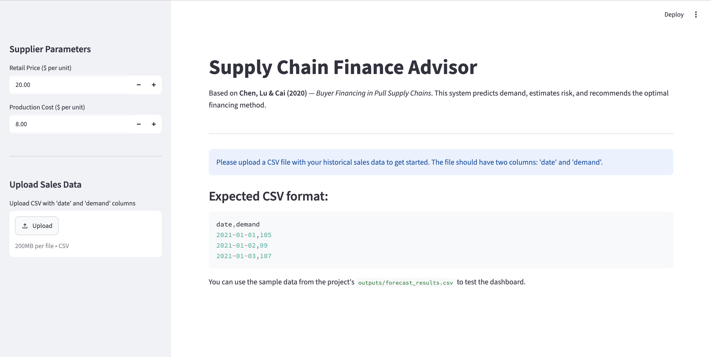
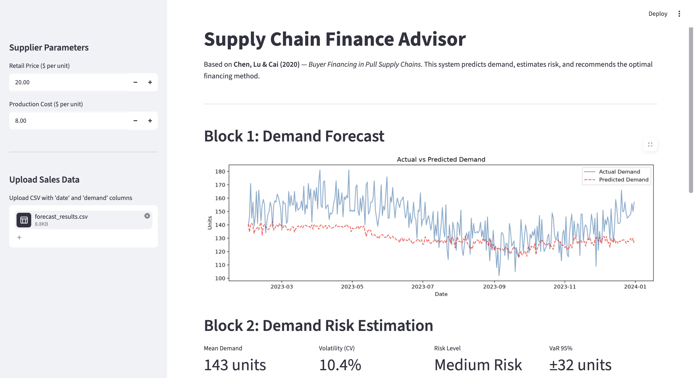
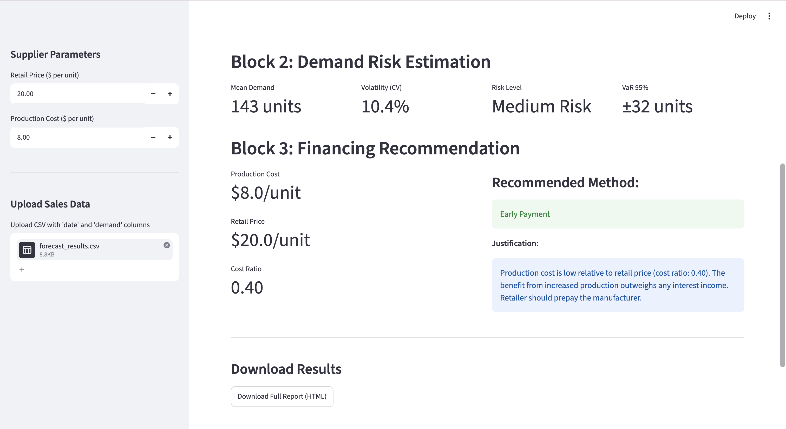
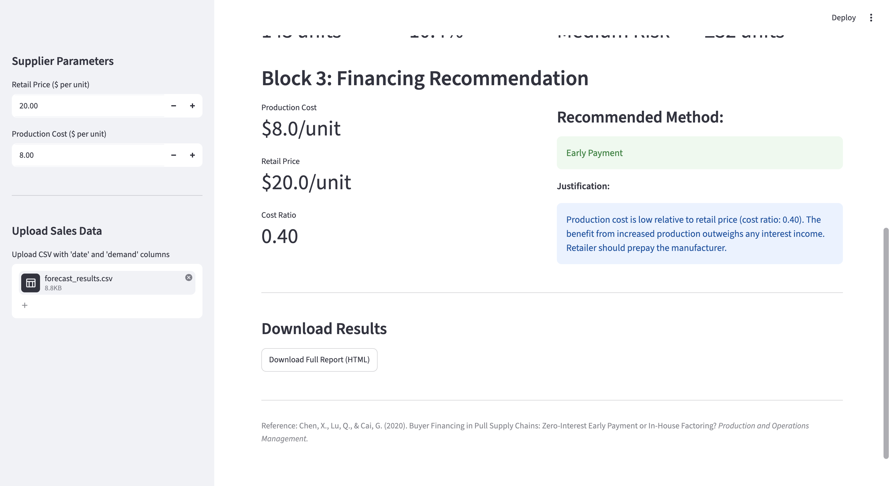
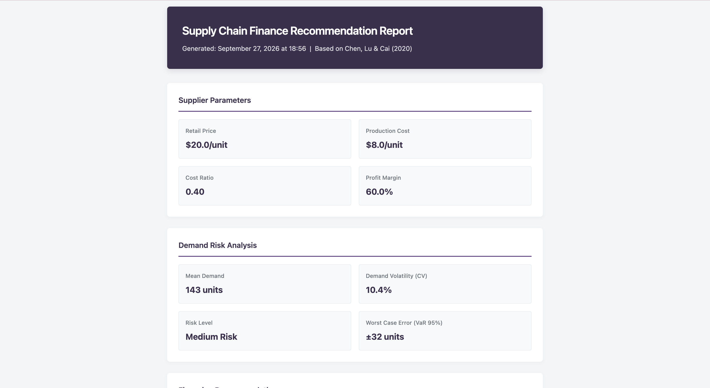
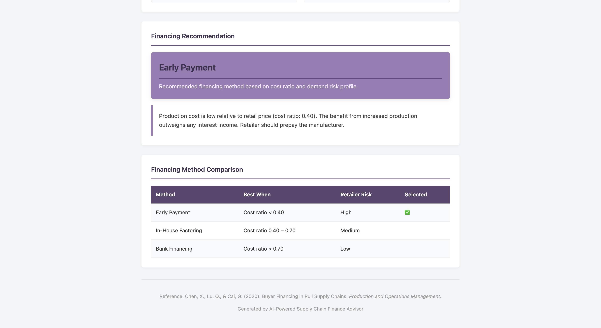

# AI-Powered Supply Chain Finance Advisor

> Extending Chen, Lu & Cai (2020) — _Buyer Financing in Pull Supply Chains_ — with machine learning demand forecasting and an interactive decision support dashboard.

---

## Overview

In pull supply chains, capital-constrained manufacturers must produce goods before retailers place orders. This creates a financing gap. **Chen, Lu & Cai (2020)** developed a mathematical framework that identifies the optimal financing method based on production cost — but their model assumes future demand is already known.

**This project fills that gap.** We replace the known-demand assumption with a machine learning forecasting pipeline, transforming a theoretical framework into a practical, deployable decision support system.

---

## Demo

### Landing Page



### Block 1 — Demand Forecast



### Block 2 — Risk Estimation



### Block 3 — Financing Recommendation



### Recommendation Changes with Production Cost


### Downloaded Report (HTML)



### Downloaded Report (Detail)



---

## The Paper's Framework

The paper compares three financing methods for a capital-constrained manufacturer selling through a capital-abundant retailer:

| Method                       | Description                                                                  | Retailer Risk |
| ---------------------------- | ---------------------------------------------------------------------------- | ------------- |
| **Early Payment (EP)**       | Retailer prepays manufacturer at zero interest                               | High          |
| **In-House Factoring (IHF)** | Retailer lends to manufacturer at positive interest via financing subsidiary | Medium        |
| **Bank Financing (BF)**      | Manufacturer borrows from external bank                                      | Low           |

**Key finding:** the optimal method depends on the manufacturer's production cost relative to the retail price:

```
Low cost ratio  → Early Payment
Medium cost ratio → In-House Factoring
High cost ratio → Bank Financing
```

**The limitation:** the paper assumes demand is known. Our project fixes this.

---

## System Architecture

```
Historical Sales Data (CSV)
        ↓
Block 1: Demand Forecasting
        Random Forest Regressor
        Lag features + rolling averages
        MAE: 14.36 units
        ↓
Block 2: Demand Risk Estimation
        Coefficient of Variation (CV)
        95th Percentile Error (VaR)
        Risk classification: Low / Medium / High
        ↓
Block 3: Financing Recommendation Engine
        Cost ratio calculation
        Risk-adjusted thresholds
        Based on Chen et al. (2020) decision logic
        ↓
Block 4: Interactive Dashboard (Streamlit)
        Upload data → get recommendation → download report
```

---

## Project Structure

```
supply_chain_finance/
│
├── data/                         # raw data storage
│
├── notebooks/
│   ├── 01_demand_forecasting.ipynb     # Block 1
│   ├── 02_demand_risk.ipynb            # Block 2
│   └── 03_recommendation_engine.ipynb # Block 3
│
├── src/
│   └── dashboard.py              # Streamlit dashboard (Block 4)
│
├── outputs/
│   ├── demand_forecast_model.pkl # trained Random Forest model
│   ├── forecast_results.csv      # test upload file
│   └── screenshots/              # dashboard screenshots
│
└── README.md
```

---

## How To Run

### 1. Clone the repository

```bash
git clone https://github.com/YOUR_USERNAME/supply_chain_finance.git
cd supply_chain_finance
```

### 2. Create virtual environment

```bash
python -m venv venv
source venv/bin/activate      # Mac/Linux
venv\Scripts\activate         # Windows
```

### 3. Install dependencies

```bash
pip install pandas numpy matplotlib seaborn scikit-learn xgboost jupyter streamlit
```

### 4. Run the notebooks in order

```bash
jupyter notebook
```

Open and run in order:

- `notebooks/01_demand_forecasting.ipynb`
- `notebooks/02_demand_risk.ipynb`
- `notebooks/03_recommendation_engine.ipynb`

### 5. Launch the dashboard

```bash
streamlit run src/dashboard.py
```

### 6. Upload data and get a recommendation

Upload `outputs/forecast_results.csv` as a test file, set your supplier parameters, and the system will generate a full financing recommendation with downloadable report.

---

## Results

### Model Performance

| Model         | MAE         | RMSE        | Selected |
| ------------- | ----------- | ----------- | -------- |
| Random Forest | 14.36 units | 17.25 units | ✅       |
| XGBoost       | 17.02 units | 19.83 units | ❌       |

### Risk Profile (Test Dataset)

| Metric                 | Value        |
| ---------------------- | ------------ |
| Mean Demand            | 142.95 units |
| Demand Volatility (CV) | 10.28%       |
| Risk Level             | Medium Risk  |
| VaR 95%                | ±31.99 units |

### Financing Recommendations

| Supplier    | Production Cost | Cost Ratio | Recommendation     |
| ----------- | --------------- | ---------- | ------------------ |
| Low Cost    | $4/unit         | 0.20       | Early Payment      |
| Medium Cost | $10/unit        | 0.50       | In-House Factoring |
| High Cost   | $16/unit        | 0.80       | Bank Financing     |

---

## Key ML Concepts Demonstrated

- Time series feature engineering (lag features, rolling means)
- Chronological train/test split (no data leakage)
- Random Forest and XGBoost regression
- Model evaluation with MAE and RMSE
- Uncertainty quantification (CV, VaR)
- End-to-end ML pipeline deployment with Streamlit

---

## Academic Reference

Chen, X., Lu, Q., & Cai, G. (2020). Buyer Financing in Pull Supply Chains: Zero-Interest Early Payment or In-House Factoring? _Production and Operations Management._ https://doi.org/10.1111/poms.13225

---

## Author

**Merjen Dursunova**  
Computer Science Student | Data Science & Machine Learning  
Portfolio project for graduate school applications in Data Science.
